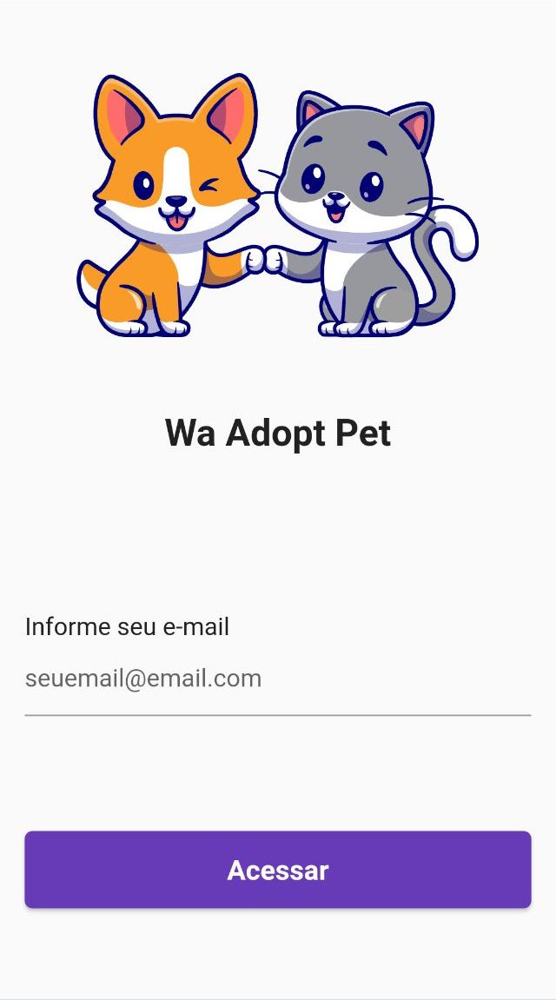
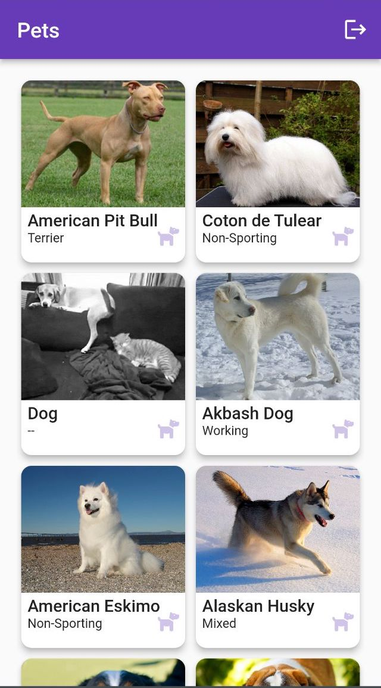
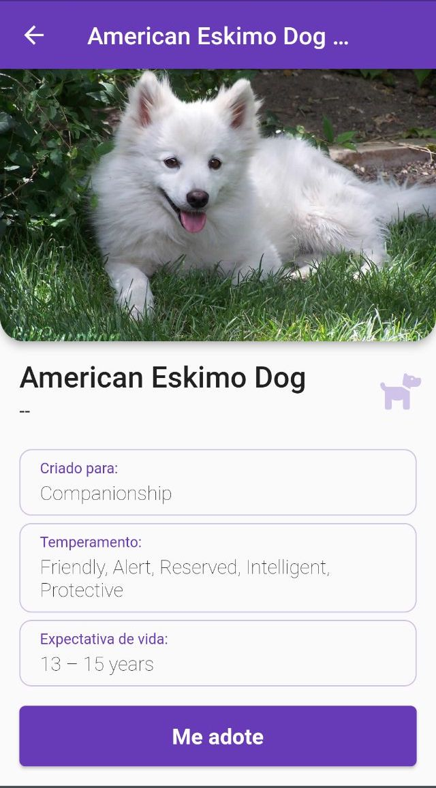
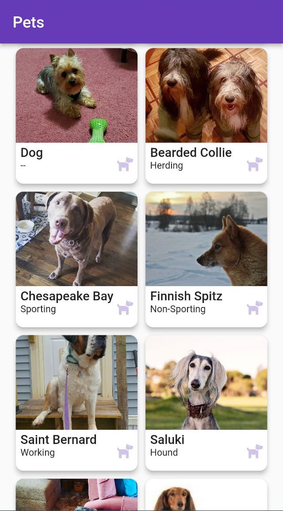

# Wa Adopt Pet

Um projeto Flutter para adoção de pets

## Como executar o aplicativo

   ```
   - Clone esse repositório:
   $ git clone https://github.com/EmersonLopes/wa_adopt_pet.git

   - Entre no diretório:
   $ cd wa_adopt_pet

   - Instale as dependências:
   $ flutter pub get

   - Inicie o app: 
   $ flutter run
   
   - Gerar apk para instalação: 
   $ flutter build apk
   ```   
## E-mails para login
  
  Utilize esses e-mails para realizar o login:
   - joao@gmail.com
   - maria@gmail.com
   - jose@gmail.com

## Imagens

   
